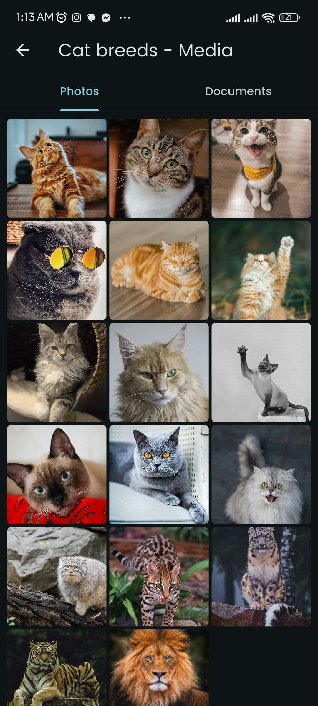
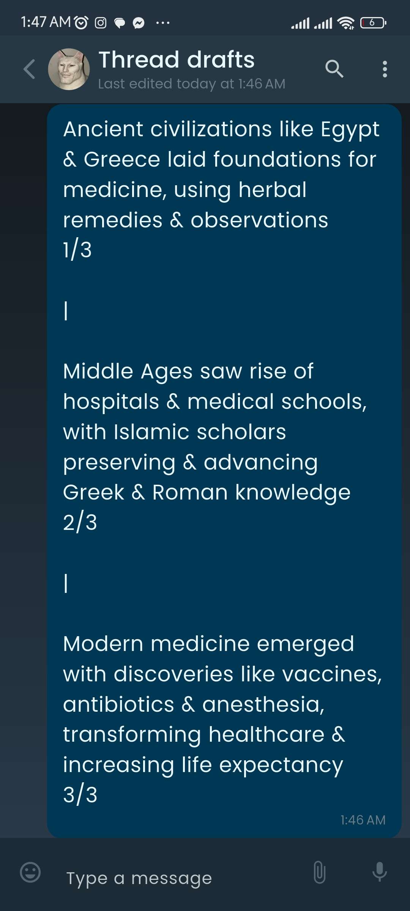

<div align="center">


# NotesApp
### Chat-style notes. Offline. Private. Powerful.

[](https://flutter.dev)
[](https://dart.dev)
[](/)
[](https://play.google.com/store/apps/details?id=com.azdhaar.notesapp)
[](/)


</div>

---

## 🎯 What is NotesApp?

**NotesApp** reimagines note-taking through the most intuitive interface humans already know — **a messaging app.**

Instead of a blank page staring back at you, every note lives inside a **chat thread** — visual, scrollable, timestamped, and instantly familiar. Turn the world's most intuitive interface into your private, all-in-one digital notebook. A powerful self-chat engine!

No accounts. No subscriptions. No cloud. **Everything stays secure on your device.** 

A revolutionary note-taking app featuring a custom self-chat engine with **Isar** local persistence and **Riverpod** state management, delivering gorgeous 60fps animations and a seamless, world-class user experience.

**Why I built this?** 
> I was tired of cluttering my WhatsApp chat to myself but also I saw everyone else doing it too so just built this cuz why the hell not lol

---

## ✨ Features

### 📁 Save Anything, Like a Real Chat
Attach any media instantly, just like you would in a real messenger:
- ✅ **Photos & Videos** – Pick from gallery or capture on the go.
- ✅ **Voice Notes** – Record thoughts with a live waveform visualization.
- ✅ **Documents** – Save PDFs, Word files, spreadsheets, and more.
- ✅ **Text & Links** – The basics, made brilliant with markdown-style formatting.

### 🔄 Introducing: Threads for Notes!
Organize connected thoughts like a social media pro! Create Threads (inspired by X/Threads) right inside your notes to:
- Plan projects step-by-step.
- Write long-form ideas or journal entries.
- Build a story or research topic.
- **Bonus:** Copy & paste your finished thread directly to social platforms with its formatting intact!

### 💡 Perfect for Organizing:
- 🛒 Shopping & Grocery Lists (with photos!)
- 🧳 Travel Plans & Packing Lists
- 💡 Project Brainstorms & Meeting Notes
- 📖 Personal Journals & Diary Entries
- 🍳 Recipe Collections with Video Clips
- 📚 Study Notes & Research Material


### 📎 Rich Media Support
| Type | Details |
|------|---------|
| 📷 **Photos** | Pick from gallery, capture with camera, paste from clipboard |
| 🎥 **Videos** | Attach and preview video clips inline |
| 🎙️ **Voice Notes** | Record audio with live waveform visualization |
| 📄 **Documents** | PDFs, Word files, spreadsheets, and more |
| 🧵 **Threads** | Twitter/X-style threaded notes within a note |
| 🖼️ **GIFs** | Animated image support |

### 🎨 Personalization
- **Per-note wallpapers** — set a custom background per notebook
- **Bubble style customization** — choose your message bubble aesthetic
- **Full dark & light theme** — system-aware with manual override
- **Custom profile avatar** with crop support

### 🔍 Search & Organization
- **Global message search** — find any note entry across all notebooks
- **In-chat search** — search within a specific notebook
- **Filter & sort** — by date, pinned, media type, and more

### 🖥️ Multi-Platform
- **Android** — full feature set, stable release
- **Windows** — alpha, custom native titlebar with `bitsdojo_window`

### 🔒 Privacy First
- **100% offline** — zero network calls, zero telemetry
- **No account required** — open the app and start noting
- **Local Isar database** — typed, fast, and entirely on-device


### 🎨 World-Class UX & Personalization
- Custom note avatars and per-chat wallpapers
- Full Light / Dark theme adapting to your system
- Global and in-chat deep search
- Inter-app sharing (Share directly from other apps into NotesApp)

---

## 📸 Screenshots

<div align="center">
  
  
  
</div>

<br>

<div align="center">
  
  
  
</div>

<br>

<div align="center">
  
  
  
</div>

<br>

<div align="center">
  
</div>

> 🎬 *Videos/GIFs showing our gorgeous 60fps animations are coming soon!*

---

## 🛠️ Tech Stack

Built for maximum performance, maintainability, and offline reliability.
| Layer | Technology | Purpose |
|-------|-----------|---------|
| **UI Framework** |  [ Flutter 3.41](https://flutter.dev) | Cross-platform UI delivering 60fps |
| **Language** |  [ Dart 3.11](https://dart.dev) | Application logic and UI rendering |
| **State Management** |  [ Riverpod 3.x](https://riverpod.dev) | Reactive state, per-feature notifiers |
| **Database** |  [ Isar 3.3.0](https://isar.dev) | Typed, blazing-fast local persistence |
**Key Packages & Tools:**
- `just_audio`, `record`, and `siri_wave` for pristine voice note experiences.
- `receive_sharing_intent` & `share_plus` to seamlessly catch shared files/links.
- `bitsdojo_window` for custom native titlebars on our Windows alpha release.
- `croppy`, `extended_image`, and `blurhash_dart` for smooth media handling.

---

## 🛠️ Project Structure

NotesApp follows an **MVVM-inspired architecture** using Riverpod as the ViewModel layer.

```
lib/
├── main.dart                     # App entry point
├── core/
│   ├── controllers/              # App-wide services (Isar, Theme, Media)
│   ├── extensions/               # Dart extensions
│   ├── Theme/                    # Design tokens, gradients, constants
│   └── utils/                    # Helpers, global keys, constants
│
└── root/
    ├── data/
    │   ├── models/               # Isar models + generated .g.dart files
    │   └── enums/                # App-wide enums
    │
    └── screens/                  # Feature screens
        ├── Homescreen/           # Notebook list + search
        ├── Chat_screen/          # Chat view + notifier + state
        ├── Chat_Detail/          # Media detail viewer
        ├── Chat_Forward/         # Forward messages between notebooks
        ├── Profile/              # User settings & avatar
        ├── Settings/             # App preferences
        └── Camera/               # In-app camera
```

**Key architectural decisions:**
- Each screen owns its **Riverpod notifier**, **state class**, and **widget subtree**
- `IsarDatabase` acts as a centralized data service accessed by notifiers
- `core/` is entirely feature-agnostic — no screen imports
- Platform-specific logic (`WindowsUtils`, titlebar theming) isolated in utilities

---

## 🚀 Getting Started

Want to see the code running? NotesApp currently supports Android (Stable) and Windows (Alpha).

### Prerequisites

| Requirement | Version |
|-------------|---------|
| Flutter SDK | `3.30+` *(Current build runs on 3.41.2)* |
| Dart SDK | `3.7+` |
| Android SDK | API `21+` |

### Installation & Build

```bash
# 1. Clone the repository
git clone https://github.com/TheMirza009/notesapp.git
cd notesapp

# 2. Fetch project dependencies
flutter pub get

# 3. Generate Isar models and Riverpod generated code
dart run build_runner build --delete-conflicting-outputs

# 4. Run the app
flutter run
```

---

## 📦 Download NotesApp

The ultimate offline self-chat experience is already available on Android devices. 

<div align="center">
  <a href="https://play.google.com/store/apps/details?id=com.azdhaar.notesapp">
    
  </a>
  <br/>
  <strong>4.9 ★ Rating &nbsp;·&nbsp; 100+ Downloads</strong>
</div>

---

## 👤 Author

**Mirza AbdulMoeed**

[](https://github.com/TheMirza009)
[](https://play.google.com/store/apps/details?id=com.azdhaar.notesapp)

---

## ⚖️ License

```
Copyright © 2024-2025 Mirza AbdulMoeed. All rights reserved.

NotesApp is proprietary software. The source code within this repository is 
made available strictly for portfolio viewing and hiring evaluation purposes. 

Unauthorized copying, forking, redistribution, modification, or commercial 
use of this codebase—in whole or in part—is strictly prohibited without 
explicit written permission from the author.
```

---

<div align="center">

**Built with 💙 in Flutter &nbsp;·&nbsp; Designed for the notes you actually use.**

*If you find this project interesting, consider leaving a ⭐ on GitHub!*

</div>