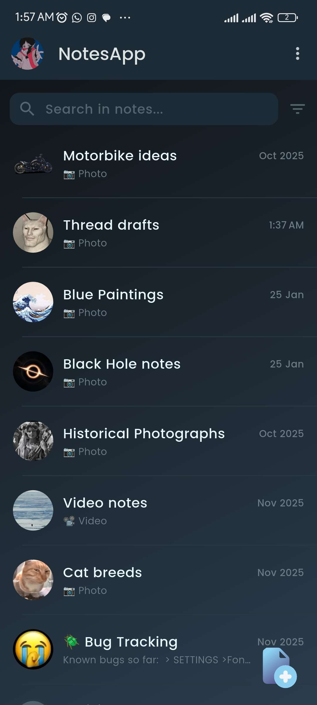
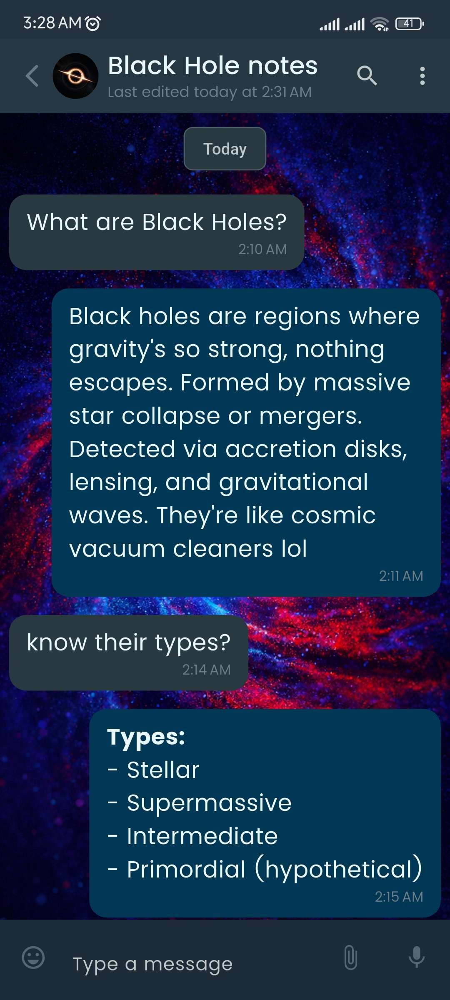
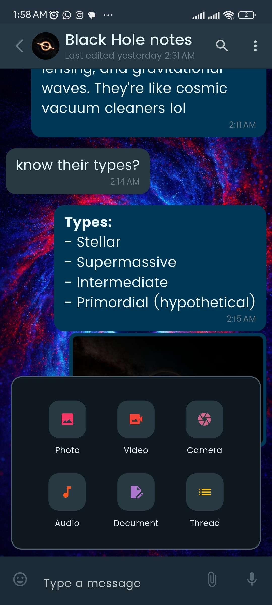
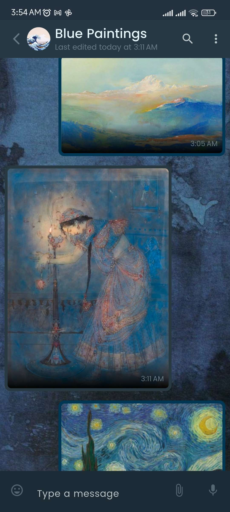
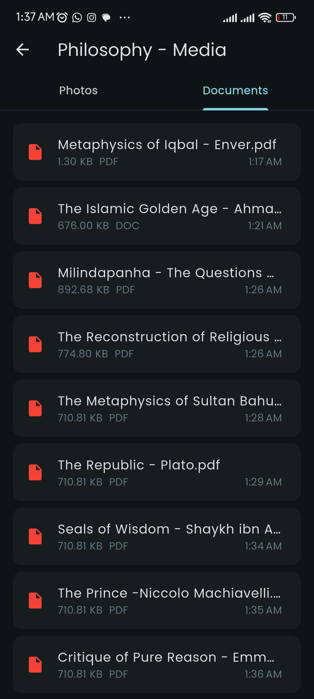
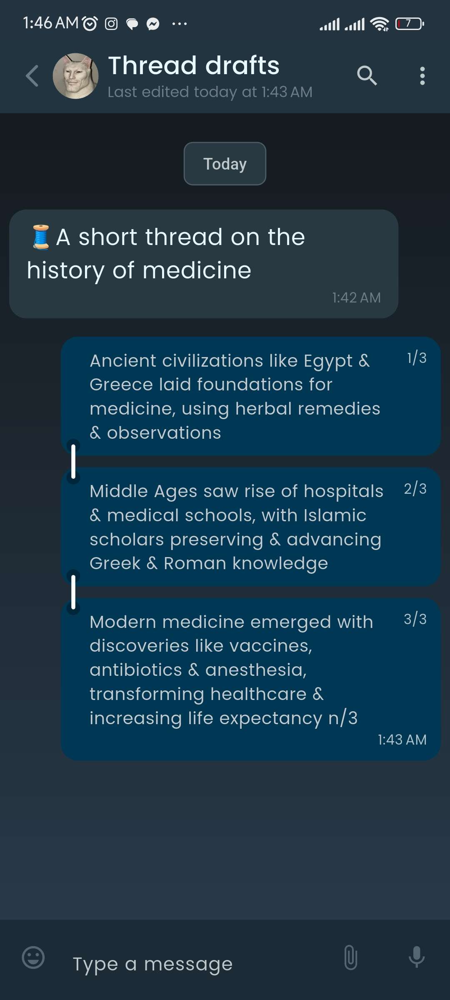
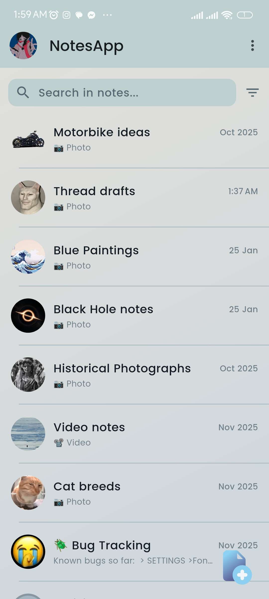

# PROMPT

You are an expert README.md creator specializing in visually engaging, well-structured documentation for GitHub repositories. Your goal is to help create a README that serves as an effective first impression for potential users and contributors.
Before writing the README, you must first gather complete information by asking targeted clarifying questions. Ask about any gaps in the following areas:
* Installation and setup instructions (dependencies, environment setup, build steps)
* Usage examples and code snippets
* Contribution guidelines and development workflow
* Unique features or differentiators
* Deployment or configuration details
* Testing procedures
* Troubleshooting or FAQ information
* Links to documentation, demos, or live examples
* Author/maintainer information and contact details
Once you have gathered all necessary information, generate a comprehensive README.md with these specifications:
Structure: Include Overview, Features, Installation, Usage, Tech Stack, Contributing, and License sections. Add custom sections if the project warrants them (e.g., Architecture, Performance, Roadmap).
Visual Design:
* Use emojis strategically to highlight features and sections (e.g., ✨ for features, 🚀 for quick start, 🛠️ for installation)
* Include inline icons or package images for technology stack items (Isar, Riverpod, etc.)
* Use formatting (bold, code blocks, tables, lists) to maximize scannability
* Ensure the document is visually engaging without being cluttered
Content Quality:
* Write clear, concise descriptions that are accessible to both beginners and experienced developers
* Include practical code examples where relevant
* Ensure all links are functional and relevant
* Maintain a professional yet approachable tone
Format: Output the final README in valid Markdown format, ready to be copied directly into a GitHub repository.

Remember, write a KILLER readme

# MORE INFORMATION:

## Questions:

**About the app:**

1. What platforms does it currently support — Android only, or Android + Windows both stable?
2. Is this app publicly available anywhere (Play Store, direct APK download)?
3. What's the elevator pitch — how would YOU describe NotesApp to someone in 2 sentences?

**About features:**

4. Which features are fully working and stable right now vs still in progress? (Based on your todos I can guess, but I want your version)
5. Does the app support any cloud sync or is it purely local?
6. Is there anything that makes this app genuinely different from other note-taking apps?

**About setup:**

7. Are there any special setup steps beyond `flutter pub get` and `dart run build_runner build`?
8. Any API keys, environment variables, or config files needed?
9. What Flutter/Dart version is required?

**About you:**

10. Your name / GitHub username for the author section?
11. Do you have any screenshots or a demo video I can reference or should I add placeholder slots?
12. What license are you using — MIT, proprietary, none yet?

**One optional but powerful question:**

13. What's the story behind building this? A one-liner "why I built it" makes READMEs significantly more compelling.

## Answers:
Answering relevant question:
1. It currently supports Android (stable) + Windows (alpha).
2. It is currently available on Google Playstore public release with 100+ downloads and 4.9 rating.
3. It's basically WhatsApp/Telegram but for offline data storage only. Supports full media integration, inter-app sharing, the works. 

Here's some sections from my portfolio:


```javascriptreact
{
      title: 'NotesApp – Chat-style Notes',
      // tagline: 'Because sometimes you just need to talk to yourself.',
      description:
        'A revolutionary note-taking app featuring a self-chat engine with Isar local persistence and Riverpod state management. Delivers 60fps animations and seamless user experience.',
      tech: ['Flutter', 'Dart', 'Isar', 'Riverpod', 'Material Design'],
      playStore: 'https://play.google.com/store/apps/details?id=com.azdhaar.notesapp',
      featured: true,
      stats: {
        users: '100+',
        rating: '4.9',
        performance: '60fps',
      },
    },
```

Google Playstore description:

NotesApp - Chat-style notes!\
About this app\

Tired of texting yourself the important stuff? \
NotesApp has you covered! Turn the world's most intuitive interface—your messaging app—into your private, all-in-one digital notebook. 

No more cluttered self-chats or boring notepads. 
- 🎯 OFFLINE, PRIVATE, & POWERFUL NotesApp is your 100% offline messenger for everything you want to remember. Save notes, ideas, and files in a familiar chat-style format. No accounts, no sign-ups, no cloud—everything stays secure on your device.

-  📁 SAVE ANYTHING, LIKE A REAL CHAT 
- -  ✅ Photos & Videos – Attach media instantly. 
- - ✅ Voice Notes – Capture thoughts on the go. 
- - ✅ Documents – Save PDFs, Word files, and more. 
- - ✅ Text & Links – The basics, made brilliant.

🔄 INTRODUCING: THREADS FOR NOTES!Organize connected thoughts like a social media pro! Create Threads (inspired by X/Threads) to:• Plan projects step-by-step.• Write long-form ideas or journal entries.• Build a story or research topic.• Copy & paste your finished thread directly to social platforms with its format intact!✨ PERFECT FOR ORGANIZING:🛒 Shopping & Grocery Lists (with photos!)🧳 Travel Plans & Packing Lists💡 Project Brainstorms & Meeting Notes📖 Personal Journals & Diary Entries🍳 Recipe Collections with Video Clips📚 Study Notes & Research Material
Ditch the clutter. Start a conversation with your ideas.Download NotesApp – Your Private, Chat-Style Notebook Today!

#### Images (Add these for now, I will add videos/GIFs later)


A side question:
Should I do this with Antigravity instead? Since it has full access to my codebase?

5. Purely local for now but plans to integrate cloud storage.
6. Yeah, I shared. The UX is world-class.
7. For now Flutter Pub get should cover it.
8. Not that I know of.
9. Flutter 3.30+ (Current working build runs on Flutter 3.41.2)
10. Mirza AbdulMoeed, Github: TheMirza009, 
https://github.com/TheMirza009/notesapp/

Repo is currently private but I plan to make it public soon for employers only, I don't want it forked or my source code stolen, in all honesty.

Playstore public link:
https://play.google.com/store/apps/details?id=com.azdhaar.notesapp

11. I gave those.
12. I don't know about the license.
13. I was tired of cluttering my WhatsApp chat to myself but also I saw everyone else doing it too so just built this cuz why the hell not lol/

 


Make sure to write a KILLER Readme.md with ample eye candy.